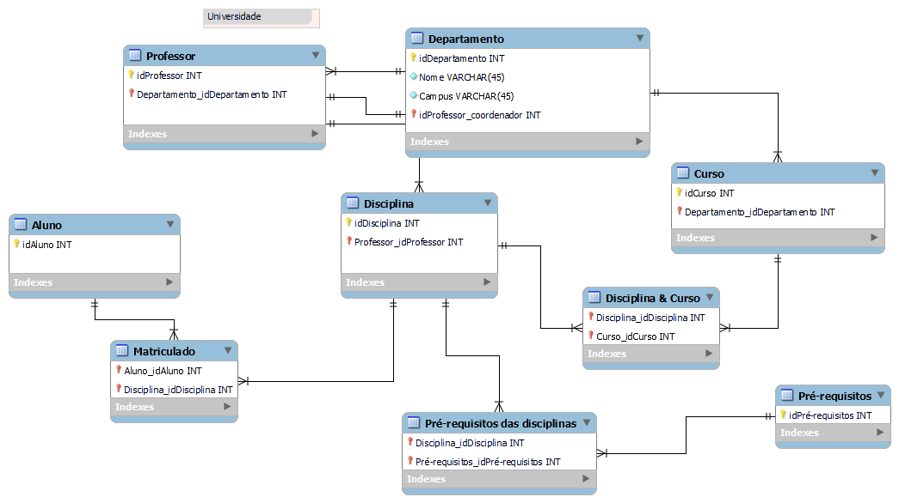
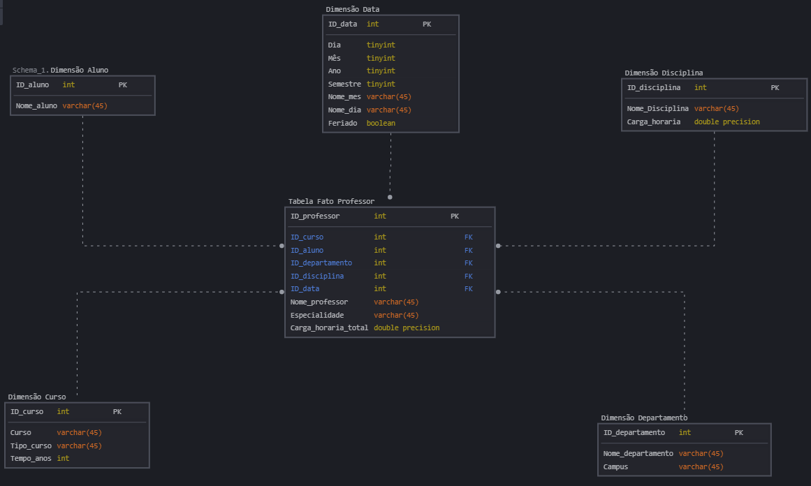

### Desafio do Módulo 4 de Power BI - Modelagem Dimensional.

Criação de diagrama dimensional – star schema – com base no diagrama relacional disponibilizado.

- **Diagrama relacional**

- **Diagrama Dimensional - Star Schema**
